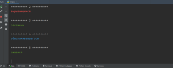
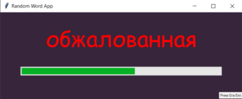
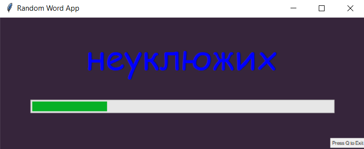
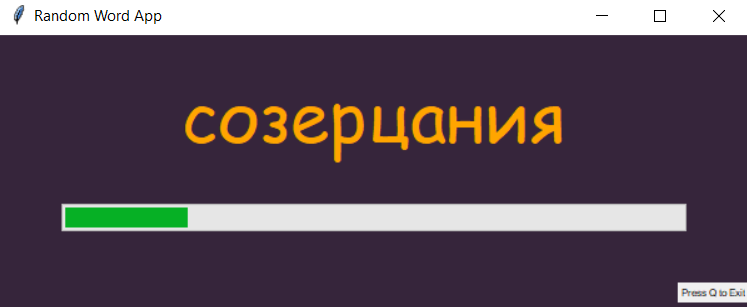

# The app generates words to learn using the voice assistant
txt file contains 1532629 Russian words  
pip install -r requirements.txt  
gui_main.py - start gui app  
main.py - start console app
press 'q' to exit  

